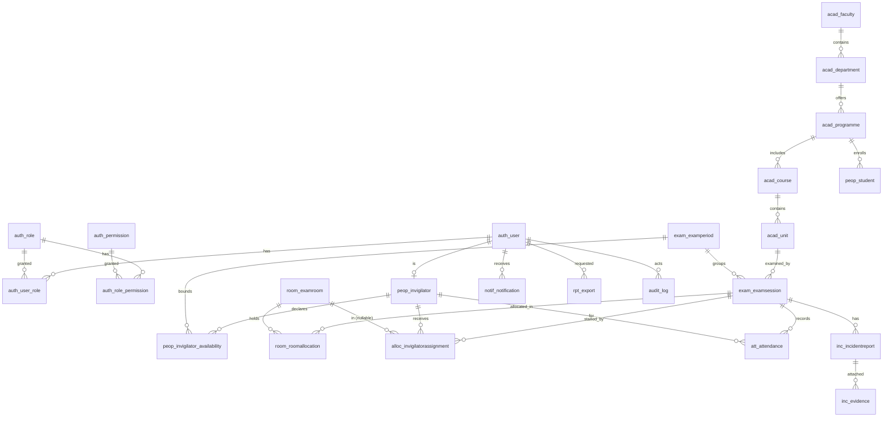

# INVIGILO — Entity-Relationship Diagram

> Companion to `02-requirements.md` §1 and `04-architecture.md` §3. Every entity from the spec is defined here, with its attributes, keys, and relationships. The Mermaid source at the end is the live version; the ASCII art is the print-friendly rendering.

---

## 1. Conventions

- Primary keys are `id` (UUIDv4). UUIDs let the system generate IDs without a round trip and avoid leaking the row count.
- `created_at` and `updated_at` are present on every mutable entity.
- `is_active` is a soft-delete flag; the row is never physically deleted.
- Foreign keys use `ON DELETE RESTRICT` for hard business references (e.g. Faculty→Department) and `ON DELETE SET NULL` for ownership references (e.g. Department→HOD) so that the loss of a user does not destroy history.
- Indexes: every FK has an index; every column referenced by a filter (`is_active`, `email`, codes) has a unique index where it is a natural key.
- All `*_at` timestamps are `TIMESTAMPTZ` and stored in UTC (NFR-CO-03).

---

## 2. Entity catalogue

The catalogue is grouped by app. Field types are PostgreSQL types.

### 2.1 accounts

#### `auth_user` (custom)
The custom user replaces `auth.User`. It holds identity, credentials, and link rows for the Invigilator profile.

| Field | Type | Notes |
|-------|------|-------|
| id | UUID | PK |
| email | CITEXT | UNIQUE, login identifier |
| password | TEXT | Argon2id hash |
| full_name | TEXT | not null |
| phone | TEXT | nullable |
| avatar_url | TEXT | nullable |
| time_zone | TEXT | IANA, default `UTC` |
| is_active | BOOLEAN | soft-delete |
| is_email_verified | BOOLEAN | default false |
| is_staff | BOOLEAN | Django admin access |
| is_superuser | BOOLEAN | super-admin flag |
| last_login_at | TIMESTAMPTZ | nullable |
| failed_login_count | INT | default 0; lockout at 5 |
| locked_until | TIMESTAMPTZ | nullable |
| created_at, updated_at | TIMESTAMPTZ | |

#### `auth_role`
| Field | Type | Notes |
|-------|------|-------|
| id | UUID | PK |
| code | TEXT | UNIQUE, e.g. `EXAMINATION_OFFICER` |
| name | TEXT | display name |
| description | TEXT | nullable |

#### `auth_permission`
| Field | Type | Notes |
|-------|------|-------|
| id | UUID | PK |
| codename | TEXT | UNIQUE, e.g. `people.invigilator.crud` |
| name | TEXT | display name |
| description | TEXT | nullable |

#### `auth_role_permission`
| Field | Type | Notes |
|-------|------|-------|
| role_id | UUID | PK part, FK→auth_role |
| permission_id | UUID | PK part, FK→auth_permission |

#### `auth_user_role`
| Field | Type | Notes |
|-------|------|-------|
| user_id | UUID | PK part, FK→auth_user |
| role_id | UUID | PK part, FK→auth_role |
| assigned_at | TIMESTAMPTZ | |

#### `auth_refresh_token`
| Field | Type | Notes |
|-------|------|-------|
| id | UUID | PK |
| user_id | UUID | FK→auth_user |
| token_hash | TEXT | UNIQUE — store hash, not the raw token |
| issued_at, expires_at | TIMESTAMPTZ | 7-day TTL |
| revoked_at | TIMESTAMPTZ | nullable |
| replaced_by_id | UUID | FK→auth_refresh_token, nullable — rotation chain |
| user_agent | TEXT | nullable |
| ip_address | INET | nullable |

#### `auth_email_verification`
| Field | Type | Notes |
|-------|------|-------|
| id | UUID | PK |
| user_id | UUID | FK→auth_user |
| token_hash | TEXT | UNIQUE |
| expires_at | TIMESTAMPTZ | 30 min |
| used_at | TIMESTAMPTZ | nullable |

#### `auth_password_reset`
Same shape as `auth_email_verification`; separate table so a reset cannot be confused with a verification.

### 2.2 academic

#### `acad_faculty`
| Field | Type | Notes |
|-------|------|-------|
| id | UUID | PK |
| code | TEXT | UNIQUE |
| name | TEXT | |
| dean_id | UUID | FK→auth_user, nullable, ON DELETE SET NULL |
| description | TEXT | nullable |
| is_active | BOOLEAN | |
| created_at, updated_at | TIMESTAMPTZ | |

#### `acad_department`
| Field | Type | Notes |
|-------|------|-------|
| id | UUID | PK |
| code | TEXT | UNIQUE within faculty |
| name | TEXT | |
| faculty_id | UUID | FK→acad_faculty |
| head_id | UUID | FK→auth_user, nullable, ON DELETE SET NULL |
| description | TEXT | nullable |
| is_active | BOOLEAN | |
| created_at, updated_at | TIMESTAMPTZ | |
| UNIQUE | (faculty_id, code) | |

#### `acad_programme`
| Field | Type | Notes |
|-------|------|-------|
| id | UUID | PK |
| code | TEXT | UNIQUE |
| name | TEXT | |
| department_id | UUID | FK→acad_department |
| duration_years | INT | |
| awarding_institution | TEXT | |
| is_active | BOOLEAN | |

#### `acad_course`
| Field | Type | Notes |
|-------|------|-------|
| id | UUID | PK |
| programme_id | UUID | FK→acad_programme |
| code | TEXT | UNIQUE within programme |
| name | TEXT | |
| level | INT | 1..6 typically |
| credit_hours | INT | |

#### `acad_unit`
| Field | Type | Notes |
|-------|------|-------|
| id | UUID | PK |
| course_id | UUID | FK→acad_course |
| code | TEXT | UNIQUE within course |
| name | TEXT | |
| credit_hours | INT | |
| semester | INT | 1 or 2 |
| is_examinable | BOOLEAN | default true |

### 2.3 people

#### `peop_student`
| Field | Type | Notes |
|-------|------|-------|
| id | UUID | PK |
| registration_number | TEXT | UNIQUE |
| full_name | TEXT | |
| email | CITEXT | UNIQUE |
| phone | TEXT | nullable |
| photo_url | TEXT | nullable |
| programme_id | UUID | FK→acad_programme |
| current_year | INT | |
| current_semester | INT | 1 or 2 |
| is_active | BOOLEAN | |

#### `peop_invigilator`
| Field | Type | Notes |
|-------|------|-------|
| id | UUID | PK |
| user_id | UUID | UNIQUE, FK→auth_user |
| employee_number | TEXT | UNIQUE |
| department_id | UUID | FK→acad_department |
| max_daily_assignments | INT | default 3 |
| max_weekly_assignments | INT | default 10 |
| is_available | BOOLEAN | default true |
| skills | TEXT[] | nullable — e.g. `{"first_aid", "sign_language"}` |

#### `peop_invigilator_availability`
| Field | Type | Notes |
|-------|------|-------|
| id | UUID | PK |
| invigilator_id | UUID | FK→peop_invigilator |
| exam_period_id | UUID | FK→exam_examperiod |
| unavailable_from | TIMESTAMPTZ | |
| unavailable_to | TIMESTAMPTZ | |
| reason | TEXT | nullable |
| CHECK | unavailable_to > unavailable_from | |

### 2.4 exam_periods

#### `exam_examperiod`
| Field | Type | Notes |
|-------|------|-------|
| id | UUID | PK |
| name | TEXT | |
| semester | INT | 1 or 2 |
| academic_year | INT | |
| starts_on | DATE | |
| ends_on | DATE | |
| is_active | BOOLEAN | partial UNIQUE INDEX where is_active = true |

#### `exam_examsession`
| Field | Type | Notes |
|-------|------|-------|
| id | UUID | PK |
| exam_period_id | UUID | FK→exam_examperiod |
| unit_id | UUID | FK→acad_unit |
| session_date | DATE | |
| starts_at | TIMESTAMPTZ | |
| ends_at | TIMESTAMPTZ | |
| expected_candidates | INT | > 0 |
| status | TEXT | enum: `draft`, `scheduled`, `in_progress`, `completed`, `archived` |
| notes | TEXT | nullable |
| CHECK | ends_at > starts_at | |
| INDEX | (exam_period_id, session_date) | |

### 2.5 rooms

#### `room_examroom`
| Field | Type | Notes |
|-------|------|-------|
| id | UUID | PK |
| code | TEXT | UNIQUE |
| name | TEXT | |
| building | TEXT | |
| floor | INT | |
| capacity | INT | > 0 |
| has_projector | BOOLEAN | default false |
| has_cctv | BOOLEAN | default false |
| is_accessible | BOOLEAN | default false |
| is_active | BOOLEAN | |

#### `room_roomallocation`
| Field | Type | Notes |
|-------|------|-------|
| id | UUID | PK |
| exam_session_id | UUID | FK→exam_examsession |
| exam_room_id | UUID | FK→room_examroom |
| allocated_capacity | INT | > 0, ≤ room.capacity |
| UNIQUE | (exam_session_id, exam_room_id) | |
| UNIQUE | (exam_room_id, session_date) via exam_session join | enforced in service |

### 2.6 allocator

#### `alloc_invigilatorassignment`
| Field | Type | Notes |
|-------|------|-------|
| id | UUID | PK |
| exam_session_id | UUID | FK→exam_examsession |
| invigilator_id | UUID | FK→peop_invigilator |
| room_id | UUID | FK→room_examroom, nullable |
| role | TEXT | enum: `lead`, `assistant` |
| status | TEXT | enum: `assigned`, `accepted`, `declined`, `replaced`, `completed` |
| assigned_by_id | UUID | FK→auth_user, nullable — null means system |
| assigned_at | TIMESTAMPTZ | |
| UNIQUE | (exam_session_id, invigilator_id) | |

#### `alloc_run`
| Field | Type | Notes |
|-------|------|-------|
| id | UUID | PK |
| exam_period_id | UUID | FK→exam_examperiod |
| triggered_by_id | UUID | FK→auth_user, nullable |
| started_at, finished_at | TIMESTAMPTZ | |
| status | TEXT | `running`, `succeeded`, `failed` |
| diagnostics | JSONB | per-session infeasibility log |

### 2.7 attendance

#### `att_attendance`
| Field | Type | Notes |
|-------|------|-------|
| id | UUID | PK |
| exam_session_id | UUID | FK→exam_examsession |
| invigilator_id | UUID | FK→peop_invigilator |
| kind | TEXT | `check_in`, `check_out` |
| at | TIMESTAMPTZ | |
| method | TEXT | `qr`, `pin`, `manual` |
| location | TEXT | nullable |
| recorded_by_id | UUID | FK→auth_user |
| late | BOOLEAN | computed on write |
| UNIQUE | (exam_session_id, invigilator_id, kind) | |

#### `att_pin`
A 6-digit PIN issued per (session, invigilator). Stored as a hash; rotated on demand.

| Field | Type | Notes |
|-------|------|-------|
| id | UUID | PK |
| exam_session_id | UUID | FK |
| invigilator_id | UUID | FK |
| pin_hash | TEXT | |
| issued_at, expires_at | TIMESTAMPTZ | |
| used_at | TIMESTAMPTZ | nullable |

### 2.8 incidents

#### `inc_incidentreport`
| Field | Type | Notes |
|-------|------|-------|
| id | UUID | PK |
| exam_session_id | UUID | FK→exam_examsession |
| exam_room_id | UUID | FK→room_examroom, nullable |
| reporter_id | UUID | FK→auth_user |
| category | TEXT | enum: `misconduct`, `late_arrival`, `cheating`, `medical`, `missing_script`, `other` |
| description | TEXT | |
| occurred_at | TIMESTAMPTZ | |
| status | TEXT | `open`, `investigating`, `resolved`, `closed` |
| resolved_by_id | UUID | FK→auth_user, nullable |
| resolved_at | TIMESTAMPTZ | nullable |
| resolution_notes | TEXT | nullable |

#### `inc_evidence`
| Field | Type | Notes |
|-------|------|-------|
| id | UUID | PK |
| incident_id | UUID | FK→inc_incidentreport |
| file | TEXT | path or S3 key |
| original_name | TEXT | |
| mime_type | TEXT | |
| size_bytes | BIGINT | |
| uploaded_by_id | UUID | FK→auth_user |
| uploaded_at | TIMESTAMPTZ | |

### 2.9 notifications

#### `notif_notification`
| Field | Type | Notes |
|-------|------|-------|
| id | UUID | PK |
| user_id | UUID | FK→auth_user |
| kind | TEXT | `assignment`, `schedule`, `attendance`, `incident`, `system` |
| title | TEXT | |
| body | TEXT | |
| link | TEXT | nullable |
| read_at | TIMESTAMPTZ | nullable |
| created_at | TIMESTAMPTZ | |
| delivered_at | TIMESTAMPTZ | nullable — set when email succeeds |

### 2.10 reports

#### `rpt_definition`
A row per named report (e.g. `attendance`).

| Field | Type | Notes |
|-------|------|-------|
| id | UUID | PK |
| code | TEXT | UNIQUE |
| name | TEXT | |
| description | TEXT | nullable |
| default_params | JSONB | |

#### `rpt_export`
| Field | Type | Notes |
|-------|------|-------|
| id | UUID | PK |
| report_code | TEXT | FK→rpt_definition.code (or id) |
| requested_by_id | UUID | FK→auth_user |
| params | JSONB | |
| format | TEXT | `pdf`, `xlsx`, `csv` |
| status | TEXT | `pending`, `running`, `ready`, `failed` |
| file | TEXT | nullable — path on completion |
| row_count | INT | nullable |
| requested_at, completed_at | TIMESTAMPTZ | |

### 2.11 audit

#### `audit_log`
Append-only.

| Field | Type | Notes |
|-------|------|-------|
| id | UUID | PK |
| actor_id | UUID | FK→auth_user, nullable |
| action | TEXT | e.g. `user.create` |
| target_type | TEXT | e.g. `accounts.user` |
| target_id | UUID | nullable |
| metadata | JSONB | |
| ip_address | INET | nullable |
| user_agent | TEXT | nullable |
| created_at | TIMESTAMPTZ | |
| INDEX | (actor_id, created_at DESC) | |
| INDEX | (action, created_at DESC) | |
| INDEX | (target_type, target_id) | |

There is no `updated_at` on this row — the row is immutable.

### 2.12 settings

#### `sys_setting`
| Field | Type | Notes |
|-------|------|-------|
| key | TEXT | PK |
| value | JSONB | |
| description | TEXT | nullable |
| updated_by_id | UUID | FK→auth_user, nullable |
| updated_at | TIMESTAMPTZ | |

---

## 3. Relationship summary

```
auth_user ──< auth_user_role >── auth_role ──< auth_role_permission >── auth_permission
auth_user 1──1 peop_invigilator
peop_invigilator 1──< peop_invigilator_availability >── exam_examperiod
acad_faculty 1──< acad_department 1──< acad_programme 1──< acad_course 1──< acad_unit
acad_unit 1──< exam_examsession >── exam_examperiod
exam_examsession 1──< room_roomallocation >── room_examroom
exam_examsession 1──< alloc_invigilatorassignment >── peop_invigilator
room_examroom 1──< alloc_invigilatorassignment (nullable)
peop_invigilator 1──< att_attendance >── exam_examsession
exam_examsession 1──< inc_incidentreport 1──< inc_evidence
auth_user 1──< notif_notification
auth_user 1──< rpt_export
audit_log → auth_user (actor, nullable)
peop_student → acad_programme
```

---

## 4. ASCII diagram

A printable view of the same model. Solid lines are FKs; dashed lines are M2M.

```
  ┌──────────────┐         ┌───────────────┐
  │  auth_user   │────┬───<│  auth_role    >──┐
  └──────┬───────┘    │    └───────────────┘  │
         │ 1          │                       │
         │            │    ┌──────────────────┴──────────┐
         │            └───<│  auth_user_role (M2M)       │
         │                 └─────────────────────────────┘
         │
         │ 1
         ▼ 1
  ┌──────────────────┐
  │ peop_invigilator │
  └──────┬───────────┘
         │ 1
         │ N
         ▼
  ┌─────────────────────────────┐
  │ peop_invigilator_availability│
  └─────────────────────────────┘

  ┌────────────┐  1   N  ┌────────────────┐  1   N  ┌────────────────┐
  │acad_faculty│─────────│ acad_department│─────────│ acad_programme │
  └────────────┘         └────────────────┘         └───────┬────────┘
                                                            │ 1   N
                                                            ▼
                                                    ┌──────────────┐
                                                    │ acad_course  │
                                                    └──────┬───────┘
                                                           │ 1   N
                                                           ▼
                                                    ┌──────────────┐
                                                    │  acad_unit   │──┐
                                                    └──────┬───────┘  │
                                                           │ 1   N    │
                                                           ▼          │
                                                  ┌──────────────────┐│
                                                  │ exam_examsession │<┘
                                                  └────┬─────────┬───┘
                                                       │         │
                                  ┌────────────────────┘         └────────────────────┐
                                  │ N                                              │ N
                                  ▼ 1                                              ▼ 1
                          ┌──────────────────┐                            ┌──────────────────┐
                          │ room_roomallocation│                          │ alloc_invigilator│
                          │                  │                            │   assignment     │
                          └────┬─────────────┘                            └────┬─────────────┘
                               │ N                                              │ N
                               ▼ 1                                              ▼ 1
                          ┌──────────────┐                            ┌──────────────────┐
                          │ room_examroom│                            │ peop_invigilator │
                          └──────────────┘                            └──────────────────┘

  ┌──────────────────┐
  │ exam_examperiod  │────< exam_examsession
  └──────────────────┘

  ┌──────────────────┐
  │ exam_examsession │──< att_attendance >── peop_invigilator
  └──────────────────┘

  ┌──────────────────┐   ┌──────────────────┐
  │ exam_examsession │──<│ inc_incidentreport│──< inc_evidence
  └──────────────────┘   └──────────────────┘

  ┌──────────────┐   ┌──────────────────┐
  │  auth_user   │──<│ notif_notification│
  └──────────────┘   └──────────────────┘

  ┌──────────────┐   ┌──────────────┐
  │  auth_user   │──<│  audit_log   │   (immutable)
  └──────────────┘   └──────────────┘
```

---

## 5. Mermaid source

The same model in Mermaid for live renderers (GitHub, docs sites, draw.io imports):



---

## 6. Cardinality summary

| Left | Cardinality | Right | Notes |
|------|-------------|-------|-------|
| auth_user | 1..N | auth_user_role | a user has 1+ roles |
| auth_role | 1..N | auth_user_role | a role is held by 0+ users |
| auth_role | 1..N | auth_role_permission | a role has 1+ permissions |
| auth_permission | 1..N | auth_role_permission | a permission is held by 1+ roles |
| auth_user | 1..1 | peop_invigilator | an invigilator user has at most one invigilator row |
| peop_invigilator | 1..N | peop_invigilator_availability | per ExamPeriod |
| acad_faculty | 1..N | acad_department | |
| acad_department | 1..N | acad_programme | |
| acad_programme | 1..N | acad_course | |
| acad_course | 1..N | acad_unit | |
| acad_unit | 1..N | exam_examsession | a unit may be examined in multiple sessions per period |
| exam_examperiod | 1..N | exam_examsession | |
| exam_examsession | 1..N | room_roomallocation | split across rooms |
| room_examroom | 1..N | room_roomallocation | a room hosts many sessions |
| exam_examsession | 1..N | alloc_invigilatorassignment | one row per (session, invigilator) |
| peop_invigilator | 1..N | alloc_invigilatorassignment | many over a period |
| exam_examsession | 1..N | att_attendance | one check-in + one check-out per invigilator |
| exam_examsession | 1..N | inc_incidentreport | |

---

## 7. Index inventory

Beyond the FK indexes, the following are explicit:

| Table | Columns | Why |
|-------|---------|-----|
| auth_user | (email) | login lookup |
| auth_user | (is_active) | filter on every user list |
| auth_refresh_token | (token_hash) | refresh lookup |
| peop_student | (registration_number) | CSV import key |
| peop_student | (programme_id, current_year, current_semester) | scheduling conflict checks |
| exam_examsession | (exam_period_id, session_date) | calendar view |
| exam_examsession | (status) | dashboard filters |
| room_roomallocation | (exam_session_id), (exam_room_id) | allocation integrity |
| alloc_invigilatorassignment | (invigilator_id, status) | dashboard "my assignments" |
| alloc_invigilatorassignment | (exam_session_id) | grid view |
| att_attendance | (exam_session_id, invigilator_id, kind) | uniqueness |
| inc_incidentreport | (exam_session_id, status) | dashboard counts |
| notif_notification | (user_id, read_at) | "unread" list |
| audit_log | (actor_id, created_at DESC) | actor search |
| audit_log | (action, created_at DESC) | action search |
| audit_log | (target_type, target_id) | target history |

---

## 8. Migration plan

The data model is shipped in a sequence of Django migrations across the apps, in dependency order:

1. `accounts` (auth_user, auth_role, auth_permission, auth_role_permission, auth_user_role, auth_refresh_token, auth_email_verification, auth_password_reset).
2. `academic` (acad_faculty, acad_department, acad_programme, acad_course, acad_unit).
3. `people` (peop_student, peop_invigilator, peop_invigilator_availability).
4. `exam_periods` (exam_examperiod, exam_examsession).
5. `rooms` (room_examroom, room_roomallocation).
6. `allocator` (alloc_invigilatorassignment, alloc_run).
7. `attendance` (att_attendance, att_pin).
8. `incidents` (inc_incidentreport, inc_evidence).
9. `notifications` (notif_notification).
10. `reports` (rpt_definition, rpt_export).
11. `audit` (audit_log).
12. `core` / `settings` (sys_setting).

A first migration per app creates the table; subsequent migrations add indexes, constraints, and seed data.
